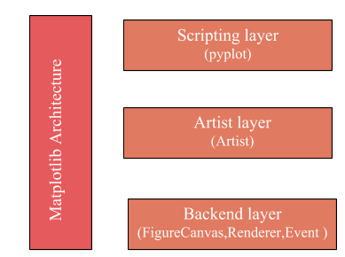

# Why Visualization
- Less is more effective 
- Less is more attractive
- Less is more impactive

# Matplotlib What is Architecture ?

## The Architecture containing 3 Layers:
- The Backend Layer
- The Artist Layer
- The Scripting Layer